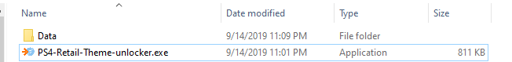
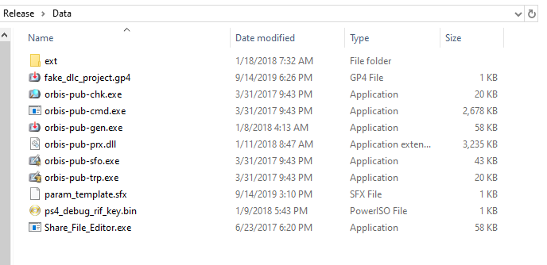

# PS4-Retail-Theme-unlocker
This tool creates an unlocker Package File(.pkg) for themes
This is what it should look like in both the main and data folder:

***Installation:***

1: download Fake_PKG_Generator

2: put all the exe's in the data folder

3: profit

***Other Questions***

Q: Will This Work On Saves?

A: No, This Is Only for Themes

Q: how do i use this?

A:  
